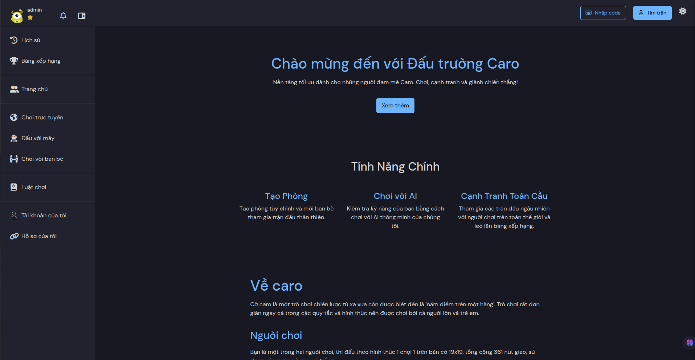
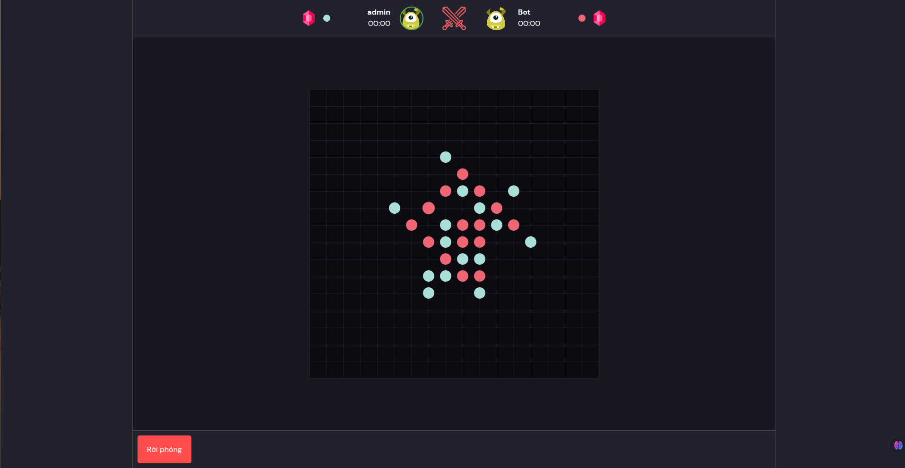
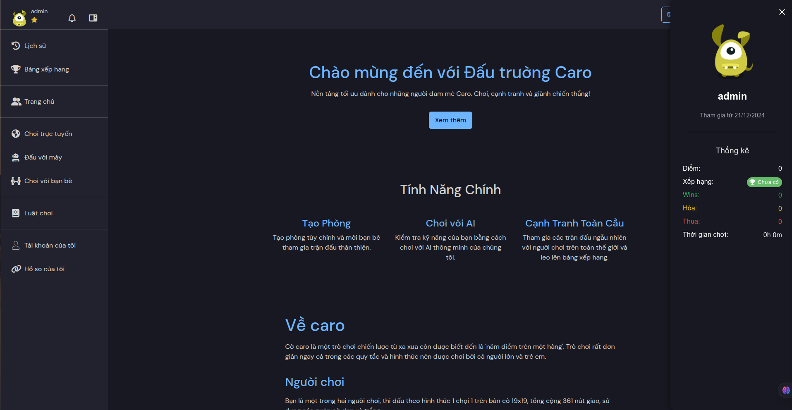
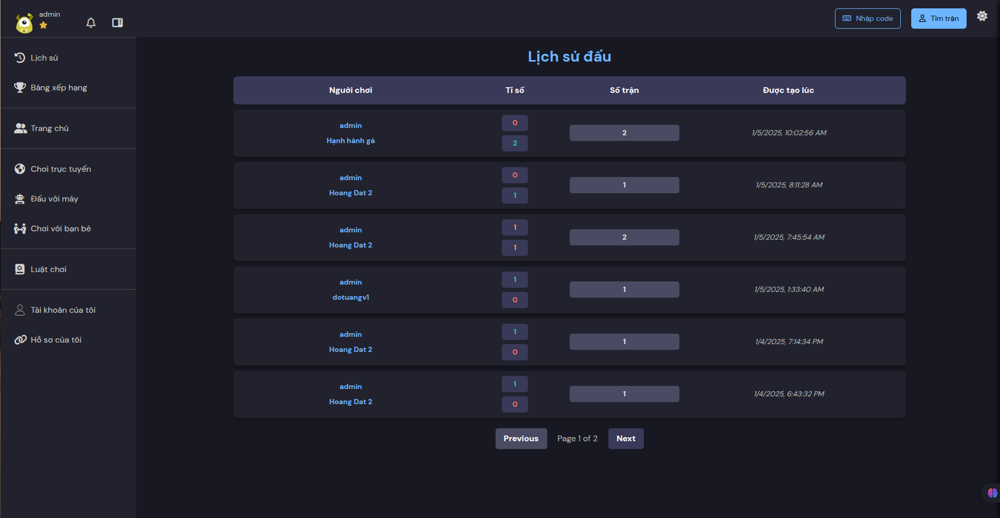

# PBL4 - Interactive Game Platform

A web-based gaming platform featuring room creation, AI opponents, and global competition.

## Table of Contents

- [Overview](#overview)
- [Technologies](#technologies)
- [Project Structure](#project-structure)
- [Features](#features)
- [Installation](#installation)
  - [Frontend Setup](#frontend-setup)
  - [Backend Setup](#backend-setup)
- [Running the Application](#running-the-application)
- [User Interface](#user-interface)
- [Contributing](#contributing)

## Overview

This project is a web-based gaming platform that allows users to create custom game rooms, play against AI, and compete with players from around the world.

## Technologies

### Frontend
- React.js
- Bootstrap
- SCSS/SASS
- JavaScript

### Backend
- Spring Boot
- Java 17
- MySQL
- RESTful API

## Project Structure

```
PBL4/
├── PBL4_FE/              # Frontend application
│   ├── public/           # Public assets
│   └── src/              # Source code
│       ├── assets/       # Static assets
│       ├── components/   # React components
│       └── ...
└── PBL4_BE/              # Backend application
    ├── src/              # Source code
    └── pom.xml           # Maven dependencies
```

## Features

- **Create Custom Rooms**: Create game rooms and invite friends for friendly matches
- **AI Opponents**: Test your skills against various difficulty levels of AI players
- **Global Competition**: Join matches with players from around the world
- **Multi-language Support**: Available in English and Vietnamese
- **Responsive Design**: Play on any device with a consistent experience

## Installation

### Frontend Setup

1. Navigate to the frontend directory:
   ```
   cd PBL4_FE
   ```

2. Install dependencies:
   ```
   npm install
   ```

3. Create a `.env` file for environment variables (if needed)

### Backend Setup

1. Navigate to the backend directory:
   ```
   cd PBL4_BE
   ```

2. Make sure you have Java 17 installed:
   ```
   java --version
   ```

3. Configure your database in `application.properties` file

4. Install Maven dependencies:
   ```
   ./mvnw clean install
   ```

## Running the Application

### Frontend

```
cd PBL4_FE
npm start
```
The application will start on http://localhost:3000

### Backend

```
cd PBL4_BE
./mvnw spring-boot:run
```
The API server will run on http://localhost:8080

## User Interface

The live version of the application is available at: [https://caroarena.netlify.app/](https://caroarena.netlify.app/)

You can visit the website to explore the following interfaces:

### Home Page


The home page showcases the main features of the platform, including room creation, AI gameplay options, and global competition information. It provides an intuitive entry point for users with language selection options.

### Game Room


The game room interface offers a clean, interactive gaming experience with real-time updates, chat functionality, and game controls optimized for different devices.

### User Profile


The user profile page displays player statistics, match history, and customization options, allowing players to track their progress and personalize their experience.

### Match History


The match history section provides players with a detailed record of their previous games, including opponents, game outcomes, timestamps, and performance metrics. This allows users to review their gameplay patterns and track improvement over time.


## Contributing

1. Fork the repository
2. Create a feature branch: `git checkout -b new-feature`
3. Commit your changes: `git commit -am 'Add new feature'`
4. Push the branch: `git push origin new-feature`
5. Submit a pull request
